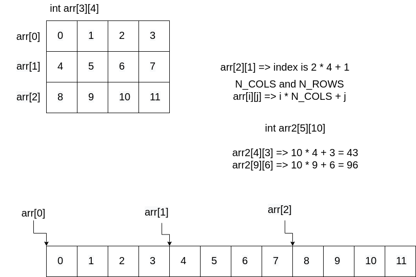

# Week 4 Tute

## 2D Arrays
A 2D array is stored as a series of 1D arrays in memory.
For a 2D array defined as `int arr[N_ROWS][N_COLS]`, the address of the index `arr[i][j]` is `N_COLS * i + j` indexes higher than the base of `arr`.



___
### 2. Translate this C program to MIPS assembler.
``` C
#include <stdio.h>

char flag[6][12] = {
    {'#', '#', '#', '#', '#', '.', '.', '#', '#', '#', '#', '#'},
    {'#', '#', '#', '#', '#', '.', '.', '#', '#', '#', '#', '#'},
    {'.', '.', '.', '.', '.', '.', '.', '.', '.', '.', '.', '.'},
    {'.', '.', '.', '.', '.', '.', '.', '.', '.', '.', '.', '.'},
    {'#', '#', '#', '#', '#', '.', '.', '#', '#', '#', '#', '#'},
    {'#', '#', '#', '#', '#', '.', '.', '#', '#', '#', '#', '#'}
};

int main(void) {
    for (int row = 0; row < 6; row++) {
        for (int col = 0; col < 12; col++)
            printf ("%c", flag[row][col]);
        printf ("\n");
    }

}
```

Translated C:
```C
#include <stdio.h>

char flag[6][12] = {
    {'#', '#', '#', '#', '#', '.', '.', '#', '#', '#', '#', '#'},
    {'#', '#', '#', '#', '#', '.', '.', '#', '#', '#', '#', '#'},
    {'.', '.', '.', '.', '.', '.', '.', '.', '.', '.', '.', '.'},
    {'.', '.', '.', '.', '.', '.', '.', '.', '.', '.', '.', '.'},
    {'#', '#', '#', '#', '#', '.', '.', '#', '#', '#', '#', '#'},
    {'#', '#', '#', '#', '#', '.', '.', '#', '#', '#', '#', '#'}
};

int main(void) {

    int row = 0;
loop0:
    if (row >= 6) goto end0;

    int col = 0;
loop1:
    if (col >= 12) goto end1;

    printf ("%c", flag[row][col]);
    col++;
    goto loop1;

end1:
    printf("\n");
    row++;
    goto loop0;

end0:
    return 0;
}
```

MIPS:
``` MIPS
	.text
main:
	li	$t0, 0		# store row in $t0

loop0:
	bge	$t0, 6, end0	# if (row >= 6) goto end0;

	li	$t1, 0		# store col in $t1

loop1:
	bge	$t1, 12, end1	# if (col >= 12) goto end1;

	li	$v0, 11

	mul	$t2, $t0, 12	# calculate how much flag[row] is higher than flag
	add	$t3, $t2, $t1	# calculate how much flag[row][col] is higher than flg
	lb	$a0, flag($t3)	# load value from flag[row][col] into $t4

	syscall			# printf("%c", flag[row][col]);


	addi	$t1, $t1, 1
	b	loop1

end1:
	li	$v0, 11
	li	$a0, '\n'
	syscall

	addi	$t0, $t0, 1
	b	loop0

end0:
	jr	$ra


	.data
flag:
	.byte '#', '#', '#', '#', '#', '.', '.', '#', '#', '#', '#', '#'
	.byte '#', '#', '#', '#', '#', '.', '.', '#', '#', '#', '#', '#'
	.byte '.', '.', '.', '.', '.', '.', '.', '.', '.', '.', '.', '.'
	.byte '.', '.', '.', '.', '.', '.', '.', '.', '.', '.', '.', '.'
	.byte '#', '#', '#', '#', '#', '.', '.', '#', '#', '#', '#', '#'
	.byte '#', '#', '#', '#', '#', '.', '.', '#', '#', '#', '#', '#'
```


___
## MIPS Functions

argument registers: `$a0..$a3`, store first four arguments for a function

return registers: `$v0 v1`, store value returned by function (`$v1` is used if value is too big to store in 4 bytes)

saved registers: `$s?` use them when you want a value to stay same between function calls


Example:
```C
int func() {
    int i = 0;
    int num = 0;
    while (i < 10) {
        // some logic
        i++;
    }

    func2();

    num++;
}
```


If you need to save need to save: $ra, $s0, $s1
``` MIPS
# original MIPS instructions
func:
# saving values from register onto the stack
func_prologue:
    addi    $sp, $sp, -4    # make space to store value from register
    sw      $ra, ($sp)      # store value from $ra on stack

    addi    $sp, $sp, -4    # make space to store value from register
    sw      $s0, ($sp)      # store value from $s0 on stack

    addi    $sp, $sp, -4    # make space to store value from register
    sw      $s1, ($sp)      # store value from $s1 on stack

func_body:
    # all the instructions you need to do

# loading values from stack back into registers
func_epilogue:
    lw      $s1, ($sp)      # restore $s1 from stack
    addi    $sp, $sp, 4     # restore stack to where it was before $s1 was saved

    lw      $s0, ($sp)      # restore $s0 from stack
    addi    $sp, $sp, 4     # restore stack to where it was before $s0 was saved

    lw      $ra, ($sp)      # restore $ra from stack
    addi    $sp, $sp, 4     # restore stack to where it was before $ra was saved
```

``` MIPS
# new mipsy pseudo instructions
func:
func_prologue:
    begin           # deal with frame pointer
    push    $ra     # create space and save $ra onto stack
    push    $s0     # create space and save $s0 onto stack
    push    $s1     # create space and save $s1 onto stack

func_body:
    # all the instructions you need to do

func_epilogue:
    pop     $s1     # restore $s1 from stack and restore stack to where it was
    pop     $s0     # restore $s0 from stack and restore stack to where it was
    pop     $ra     # restore $ra from stack and restore stack to where it was
    end             # restore frame pointer
```

___

### 3. Translate this C program to MIPS assembler.
``` C
int max(int a[], int length) {
    int first_element = a[0];
    if (length == 1) {
        return first_element;
    } else {
        // find max value in rest of array
        int max_so_far = max(&a[1], length - 1);
        if (first_element > max_so_far) {
            max_so_far = first_element;
        }
        return max_so_far;
    }
}
```

Translated C:
```C
int max(int a[], int length) {
    int first_element = a[0];

    if (length != 1) goto length_greater;
    return first_element;

length_greater:
    int max_so_far = max(&a[1], length - 1);
    if (first_element <= max_so_far) goto max_end;
    max_so_far = first_element;

max_end:
    return max_so_far;
}
```

``` MIPS
	.text

	# max gets called with 2 arguments:
	# $a0: int a[];
	# $a1: int length;
max:
max_prologue:
	# save: first_element
	begin
	push	$ra		# need to call function
	push	$s0		# save first_element in $s0
	push	$s1		# save a into $s1
	push	$s2		# save length into $s2

	move	$s1, $a0
	move	$s2, $a1

max_body:
	lw	$s0, ($a0)	# stores first_element = a[0] in $s0

	bne	$a1, 1, length_greater;
	move	$v0, $s0	# store first_elemnt in $v0 to return
	b	max_epilogue	# going to return

length_greater:
	addi	$a0, $a0, 4	# address of a[1]
	addi	$a1, $a1, -1	# length - 1
	jal	max		# call max(&a[1], length - 1)
				# max_so_far is stored in $v0

	ble	$s0, $v0, max_epilogue
	move	$v0, $s0	# stores first_element in return register

max_epilogue:
	# clean up stack
	pop	$s2		# restore $s2
	pop	$s1		# restore $s1
	pop	$s0		# restore $s0
	pop	$ra		# restore $ra
	end

	jr	$ra		# actually returns

```


___
### 5. Translate this C program to MIPS assembler using normal function calling conventions.
### `sum2` is a very simple function but don't rely on this when implementing `sum4`.
``` C
// sum 4 numbers using function calls

#include <stdio.h>

int sum4(int a, int b, int c, int d);
int sum2(int x, int y);

int main(void) {
    int z = sum4(11, 13, 17, 19);
    printf("%d\n", z);
    return 0;
}

int sum4(int a, int b, int c, int d) {
    int e = sum2(a, b);
    int f = sum2(c, d);
    return sum2(e, f);
}

int sum2(int x, int y) {
    return x + y;
}
```

MIPS:
``` MIPS
	.text
main:
main_prologue:
	begin
	push	$ra		# save $ra since we need to call sum4

main_body:
	li	$a0, 11
	li	$a1, 13
	li	$a2, 17
	li	$a3, 19
	jal	sum4		# calls sum4(11, 13, 17, 19)

	move	$a0, $v0	# stores z in $a0
	li	$v0, 1
	syscall

	li	$v0, 11
	li	$a0, '\n'
	syscall

main_epilogue:
	pop	$ra
	end

	jr	$ra


sum4:
sum4_prologue:
	# need to save variables: c, d, e, f
	begin
	push	$ra		# save $ra since we need to call sum2
	push	$s0		# store c in $s0
	push	$s1		# store d in $s1
	push	$s2		# store e in $s2
	push	$s3		# store f in $s3

	move	$s0, $a2	# move c into $s0
	move	$s1, $a3	# move d into $s1

sum4_body:
	jal	sum2		# call sum2(a, b)

	move	$s2, $v0	# stores e in $s2

	move	$a0, $s0
	move	$a1, $s1
	jal	sum2		# call sum2(c, d)

	move	$s3, $v0	# stores f in $s3

	move	$a0, $s2
	move	$s1, $s3
	jal	sum2		# calls sum2(e, f)

sum4_epilogue:
	pop	$s3
	pop	$s2
	pop	$s1
	pop	$s0
	pop	$ra
	end

	jr	$ra


sum2:
	addi	$v0, $a0, $a1
	jr	$ra
```
