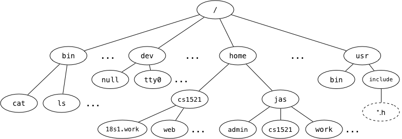

# Week 8 Tute


### 1. We say that the Unix filesystem is tree-structured, with the directory called / as the root of the tree, e.g.,



### Answer the following based on the above diagram:

### a) What is the full pathname of COMP1521's `web` directory?
/home/cs1521/web

### b) Which directory is `~jas/../..`?
root directory or /

### c) Links to the children of a given directory are stored as entries in the directory structure. Where is the link to the parent directory stored?
..

### d) What kind of filesystem object is `cat`?
Regular file

### e) What kind of filesystem object is `home`?
Directory

### f) What kind of filesystem object is `tty0`?
Character special file which represents a device

### g) What kind of filesystem object is a symbolic link? What value does it contain?
Name of file that is being linked to

### h) Symbolic links change the filesystem from a tree structure to a graph structure. How do they do this?
Lets you create arbitrary connections between directories

___
### 2. Write a C program, fgrep.c, which is given 1+ command-line arguments which is a string to search for.
### If there is only 1 command-line argument it should read lines from stdin and print them to stdout iff they contain the string specified as the first command line argument.
### If there are 2 or more command line arguments, it should treat arguments after the first as fiilenames and print any lines they contain which contain the string specified as the first command line arguments.
### When printing lines your program should prefix them with a line number.
### It should print suitable error messages if given an incorrect number of arguments or if there is an error opening a file.

```C
#include <stdio.h>
#include <string.h>

/*
    dcc -o file q2.c

    ./file a b c d e

    argv = [file, a, b, c, d, e, NULL]

*/

#define MAX_LINE_LENGTH 1000

void search_in_file(FILE *file, char *filename, char *search_string) {
    char s[MAX_LINE_LENGTH] = {0};
    int lineno = 0;
    while (fgets(s, MAX_LINE_LENGTH, file) != NULL) {
        if (strstr(s, search_string)) {
            printf("%s %d: %s", filename, lineno, s);
        }

        lineno++;
    }
}


int main(int argc, char *argv[]) {
    if (argc < 2) {
        fprintf(stderr, "Usage: %s <search string> <optionally: files to search through>\n", argv[0]);
        return 1;
    } else if (argc == 2) {
        search_in_file(stdin, "stdin", argv[1]);
    } else {
        for (int i = 2; i < argc; i++) {
            FILE *file = fopen(argv[i], "r");
            if (file == NULL) {
                perror(argv[i]);
                return 1;
            }

            search_in_file(file, argv[i], argv[1]);
            fclose(file);
        }
    }

    return 0;
}
```

___
### 3. What does `fopen` do? What are its parameters?
`fopen` opens a file.

Parameters are the filename and mode which is how the file should be opened.

Use [`man fopen`](https://man7.org/linux/man-pages/man3/fopen.3.html) for more details

___
### 4. What are some circumstances when `fopen` returns NULL?
Some reasons include
* file that does not exist
* file that you don't have the right permissions for
* invalid mode string

___
### 5. How do you print the specific reason that caused `fopen` to return `NULL`?
`perror` takes in a string, prints the string and then looks at the error number which was set when `fopen` fails and prints the error as a string.

Only use `perror` when the `errno` is set, otherwise it will print ": Success" after your string.

Use [`man perror`](https://man7.org/linux/man-pages/man3/perror.3.html) for more details.

___
### 6. Write a C program, `first_line.c`, which is given one command-line argument, the name of a file, and which prints the first line of that file to stdout. If given an incorrect number of arguments, or if there was an error opening the file, it should print a suitable error message.
Similar to q7

___
### 7. Write a C program, `write_line.c`, which is given one command-line argument, the name of a file, and which reads a line from `stdin`, and writes it to the specified file; if the file exists, it should be overwritten.
```C
#include <stdio.h>

#define MAX_LINE_LENGTH 1000

int main(int argc, char *argv[]) {
    if (argc != 2) {
        fprintf(stderr, "Usage: %s <file>\n", argv[0]);
        return 1;
    }

    char line[MAX_LINE_LENGTH] = {0};
    fgets(line, MAX_LINE_LENGTH, stdin);

    FILE *file = fopen(argv[1], "w");
    if (file == NULL) {
        perror(argv[1]);
        return 1;
    }

    fputs(line, file);
    fclose(file);

    return 0;
}
```

___
### 8. Write a C program, `append_line.c`, which is given one command-line argument, the name of a file, and which reads a line from `stdin` and appends it to the specified file.
Similar to q7

___
### 9. Why should you not use `fgets` or `fputs` with binary data?
There may be 0s in your data which are interpreted as `fgets` and `fputs` as null terminators, so they will stop reading the data after a 0.

___
### 11. How many different values can `fgetc` return?
All character values and also EOF so 256 + 1 = 257.

___
### 12. Why are the names of `fgetc`, `fputc`, `getc`, `putc`, `putchar`, and `getchar` misleading?
Misleading because they are for bytes, not just specifically characters.

___
### 13. For each of the following calls to the fopen() library function, give an open() system call that has equivalent semantics relative to the state of the file.
### Obviously, fopen() returns a FILE*, and open() returns an integer file descriptor. Ignore this for the purposes of the question; focus on the state of the open file.

### a)
``` C
fopen(FilePath, "r")
```
```C
open(FilePath, O_RDONLY);
```

### b)
``` C
fopen(FilePath, "a")
```
```C
open(FilePath, O_WRONLY|O_APPEND|O_CREAT);
```

### c)
``` C
fopen(FilePath, "w")
```
```C
open(FilePath, O_WRONLY|O_TRUNC|O_CREAT);
```

### d)
``` C
fopen(FilePath, "r+")
```
```C
open(FilePath, O_RDWR);
```

### e)
``` C
fopen(FilePath, "w+")
```
```C
open(FilePath, O_RDWR|O_CREAT|O_TRUNC);
```

___
### 14. Consider the `lseek(fd, offset, whence)` function.
### a) What is its purpose?
Move to a certain part of the file.

`fd` is the file descriptor which is being moved.

`offset` can be positive or negative, `whence` can be `SEEK_SET`, `SEEK_CUR` or `SEEK_END` which means the beginning of the file, current offset in the file or end of the file respectively. The `offset` is taken relative to `whence`.

### b) When would it be useful?
`lseek` is useful if you have structured data and want to move to a particular point in the file.

### c) What does its return value represent?
The return value is the current offset in the file or -1 if `lseek` failed.

___
### 15. Consider a file of size 10000 bytes, open for reading on file descriptor fd, initially positioned at the start of the file (offset 0). What will be the file position after each of these calls to lseek()? Assume that they are executed in sequence, and one will change the file state that the next one deals with.

Offset: 0
### a)
``` C
lseek(fd, 0, SEEK_END);
```
Offset: 10,000

### b)
``` C
lseek(fd, -1000, SEEK_CUR);
```
Offset: 9,000

### c)
``` C
lseek(fd, 0, SEEK_SET);
```
Offset: 0

### d)
``` C
lseek(fd, -100, SEEK_SET);
```
Offset: 0

### e)
``` C
lseek(fd, 1000, SEEK_SET);
```
Offset: 1000

### f)
``` C
lseek(fd, 1000, SEEK_CUR);
```
Offset: 2000

___
### 16. If a file `xyz` contains 2500 bytes, and it is scanned using the following code:
``` C
int fd;         // open file descriptor
int nb;         // # bytes read
int ns = 0;     // # spaces
char buf[BUFSIZ]; // input buffer

fd = open ("xyz", O_RDONLY);
assert (fd >= 0);
while ((nb = read (fd, buf, 1000)) > 0) {
    for (int i = 0; i < nb; i++)
        if (isspace (buf[i]))
            ns++;
}
close (fd);
```

### Assume that all of the relevant `#include`'s are done.
### How many calls with be made to the `read()` function, and what is the value of nb after each call?

| call number | nb | file position |
|:---:|:---:|:---:|
| 1 | 1000 | 1000 |
| 2 | 1000 | 2000 |
| 3 | 500 | 2500 |
| 4 | 0 | 2500 |
