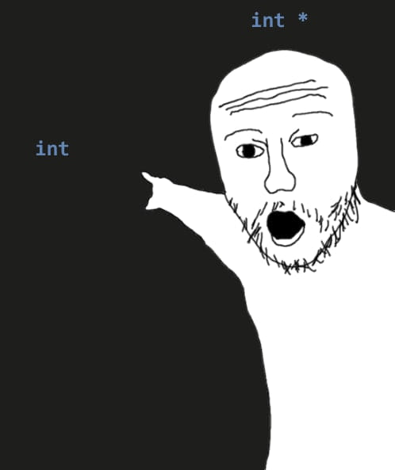
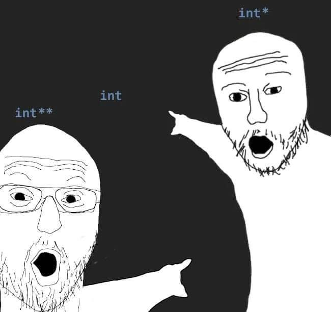

# Week 9 Tute


### 1. Write a C program, `print_diary.c`, which prints the contents of the file `$HOME/.diary` to `stdout`
### The lecture example `getstatus.c` shows how to get the value of an environment variable.
### `snprintf` is a convenient function for constructing the pathname of the diary file.

```C
#include <stdio.h>
#include <stdlib.h>

#define PATH_LEN 256

int main(void) {
    char *home = getenv("HOME");
    char path[PATH_LEN];
    snprintf(path, PATH_LEN, "%s/.diary", home);

    FILE *file = fopen(path, "r");
    if (file == NULL) {
        perror(path);
        return 1;
    }

    int byte;
    while ((byte = fgetc(file)) != EOF) {
        putchar(byte);
    }

    fclose(file);
    return 0;
}
```
___
### 2. The `stat()` and `lstat()` functions both take an argument which is a pointer to a struct stat object, and fill it with the meta-data for a named file.

### On Linux, a `struct stat` contains the following fields (among others, which have omitted for simplicity):
``` C
struct stat {
    ino_t st_ino;         /* inode number */
    mode_t st_mode;       /* protection */
    uid_t st_uid;         /* user ID of owner */
    gid_t st_gid;         /* group ID of owner */
    off_t st_size;        /* total size, in bytes */
    blksize_t st_blksize; /* blocksize for filesystem I/O */
    blkcnt_t st_blocks;   /* number of 512B blocks allocated */
    time_t st_atime;      /* time of last access */
    time_t st_mtime;      /* time of last modification */
    time_t st_ctime;      /* time of last status change */
};
```

### Explain what each of the fields represents (in more detail than given in the comment!) and give a typical value for a regular file which appears as follows:
``` sh
$ ls -ls stat.c
8 -rw-r--r--  1 jas  cs1521  1855  Sep  9 14:24 stat.c
```
### Assume that `jas` has user id 516, and the `cs1521` group has group id 36820.
* An inode number lets you know where a file's metadata is stored
* Mode tells you the type of file and its permissions
* Each user has an id associated with them
* Each group of users has an id associated with them
* Different filesystems store files in different block sizes
* Status change means either data or metadata has changed

___
### 3. Consider the following (edited) output from the command `ls -l ~cs1521`:
``` sh
drwxr-x--- 11 cs1521 cs1521 4096 Aug 27 11:59 17s2.work
drwxr-xr-x  2 cs1521 cs1521 4096 Aug 20 13:20 bin
-rw-r-----  1 cs1521 cs1521   38 Jul 20 14:28 give.spec
drwxr-xr-x  3 cs1521 cs1521 4096 Aug 20 13:20 lib
drwxr-x--x  3 cs1521 cs1521 4096 Jul 20 10:58 public_html
drwxr-xr-x 12 cs1521 cs1521 4096 Aug 13 17:31 spim
drwxr-x---  2 cs1521 cs1521 4096 Sep  4 15:18 tmp
lrwxrwxrwx  1 cs1521 cs1521   11 Jul 16 18:33 web -> public_html
```
### a) Who can access the `17s2.work` directory?
The user `cs1521` can see the files in the directory, add or remove files to the directory and also access files within the directory.

The group `cs1521` can see the files in the directory and also access files within the directory.

Everyone else can't do anything to the directory.

### b) What operations can a typical user perform on the public_html directory?
A typical user can only access files within the directory if they already know the path to it.

### c) What is the file web?
`web` is a symbolic link to the directory `public_html`.

### d) What is the difference between `stat("web", &info)` and `lstat("web", &info`)?
### (where info is an object of type (`struct stat`))
`stat` will give us information about `public_html`.

`lstat` will give us information about the symbolic link `web` itself.

___
### 4. Write a C program, chmod_if_public_write.c, which is given 1+ command-line arguments which are the pathnames of files or directories
### If the file or directory is publically-writeable, it should change it to be not publically-writeable, leaving other permissions unchanged.

### It also should print a line to stdout as in the example below
``` sh
$ dcc chmod_if_public_write.c -o chmod_if_public_write
$ ls -ld file_modes.c file_modes file_sizes.c file_sizes
-rwxr-xrwx 1 z5555555 z5555555 116744 Nov  2 13:00 file_sizes
-rw-r--r-- 1 z5555555 z5555555    604 Nov  2 12:58 file_sizes.c
-rwxr-xr-x 1 z5555555 z5555555 222672 Nov  2 13:00 file_modes
-rw-r--rw- 1 z5555555 z5555555   2934 Nov  2 12:59 file_modes.c
$ ./file_modes file_modes file_modes.c file_sizes file_sizes.c
removing public write from file_sizes
file_sizes.c is not publically writable
file_modes is not publically writable
removing public write from file_modes.c
$ ls -ld file_modes.c file_modes file_sizes.c file_sizes
-rwxr-xr-x 1 z5555555 z5555555 116744 Nov  2 13:00 file_sizes
-rw-r--r-- 1 z5555555 z5555555    604 Nov  2 12:58 file_sizes.c
-rwxr-xr-x 1 z5555555 z5555555 222672 Nov  2 13:00 file_modes
-rw-r--r-- 1 z5555555 z5555555   2934 Nov  2 12:59 file_modes.c
```
### Make sure you handle errors.

```C
#include <stdio.h>
#include <sys/types.h>
#include <sys/stat.h>
#include <unistd.h>


int main(int argc, char *argv[]) {
    if (argc < 2) {
        fprintf(stderr, "Usage: %s <filenames>\n", argv[0]);
        return 1;
    }

    for (int i = 1; i < argc; i++) {
        struct stat s;
        if (!stat(argv[i], &s)) {
            perror(argv[i]);
            return 1;
        }

        mode_t file_mode = s.st_mode;
        if (file_mode & S_IWOTH) {
            file_mode = file_mode & (~S_IWOTH);
            // file_mode = file_mode ^ S_IWOTH;

            if (!chmod(argv[i], file_mode)) {
                perror(argv[i]);
                return 1;
            }

            printf("removing public write from %s\n", argv[i]);
        } else {
            printf("%s is not publically writeable\n", argv[i]);
        }
    }

    return 0;
}
```

___
### 6. Write a C program, `print_file_bits.c`, which given as a command line arguments the name of a file contain 32-bit hexadecimal numbers, one per line, prints the low (least significant) bytes of each number as a signed decimal number (-128..127).

```C
#include <stdio.h>
#include <stdlib.h>
#include <stdint.h>

void process_file(char *filename) {
    FILE *file = fopen(filename, "r");
    if (file == NULL) {
        perror(filename);
        exit(1);
    }

    int32_t num;
    while (fscanf("%d", &num)) {
        num = num & 0xFF;
        if (num & (1 << 7)) {
            num = num | 0xFFFFFF00;
        }

        printf("%d\n", num);
    }

    fclose(file);
}


int main(int argc, char *argv[]) {
    if (argc < 2) {
        fprintf(stderr, "Usage: %s <filenames>\n", argv[0]);
        return 1;
    }

    for (int i = 1; i < argc; i++) {
        process_file(argv[i]);
    }

    return 0;
}
```
___
### 7. Write a C program, now.c, which prints the following information:

1. The current date.
2. The current time.
3. The current user.
4. The current hostname.
5. The current working directory.

```sh
dcc now.c -o now
./now
29-02-2022
03:59:60
cs1521
zappa.orchestra.cse.unsw.EDU.AU
/home/cs1521/lab08
```

The following commands might be useful:
```sh
date +%d-%m-%Y
date +%T
whoami
hostname -f
realpath .
```

```C
#include <stdio.h>
#include <stdlib.h>
#include <spawn.h>
#include <sys/types.h>
#include <sys/wait.h>

extern char **environ;

void execute_program(char **args) {
    pid_t pid;
    if (posix_spawn(&pid, args[0], NULL, NULL, args, environ) != 0) {
        perror("posix_spawn");
        exit(1);
    }

    int status;
    if (waitpid(pid, &status, 0) == -1) {
        perror("waitpid");
        exit(1);
    }
}

int main(void) {
    execute_program((char *[]){"/bin/date", "+%d-%m-%Y", NULL});
    execute_program((char *[]){"/bin/data", "+%T", NULL});
    execute_program((char *[]){"/usr/bin/whoami", NULL});
    execute_program((char *[]){"/bin/hostname", "-f", NULL});
    execute_program((char *[]){"/usr/bin/realpath", ".", NULL});
    return 0;
}
```

___
## Assignment 2

